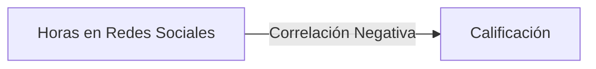
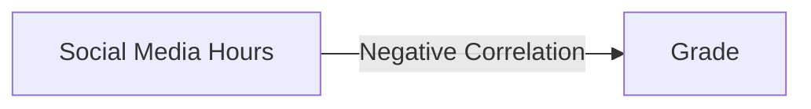

# 📚 Análisis del Rendimiento Estudiantil
## Una Mirada Profunda a los Factores del Éxito Académico 🎓


## 🎯 Descripción General del Proyecto

Este notebook Jupyter analiza varios factores que afectan el rendimiento académico de los estudiantes, proporcionando información sobre las relaciones entre los hábitos de estudio, el estilo de vida y los resultados académicos.

### 🔍 Áreas Clave de Análisis

- 📖 Impacto de las Horas de Estudio
- 💻 Uso de Redes Sociales
- 🎬 Consumo de Netflix
- 😴 Patrones de Sueño
- 👥 Diferencias de Género
- 💼 Efectos del Trabajo a Tiempo Parcial
- 🏃 Actividades Extracurriculares
- 🍎 Calidad de la Dieta
- 🧠 Salud Mental

## 🛠️ Tecnologías Utilizadas

- **Python** 3.x
- **Bibliotecas**:
   - pandas (manipulación de datos)
   - numpy (operaciones numéricas)
   - matplotlib & seaborn (visualizaciones estáticas)
   - plotly (visualizaciones interactivas)
   - scipy (análisis estadístico)

## 📊 Hallazgos Principales

### Horas de Estudio vs Rendimiento
> **Correlación: 0.75**
- Fuerte correlación positiva entre horas de estudio y calificaciones
- Cada hora adicional de estudio asociada con mayor rendimiento

### Impacto de las Redes Sociales


### Patrones de Sueño
| Horas de Sueño | Impacto en el Rendimiento |
|----------------|---------------------------|
| < 6 horas      | ⬇️ Calificaciones más bajas |
| 7-8 horas      | ⬆️ Rango óptimo |
| > 9 horas      | ➡️ Rendimientos decrecientes |

## 🎨 Visualizaciones

El notebook incluye varias visualizaciones interactivas y estáticas:
- Diagramas de caja para comparaciones categóricas
- Gráficos de dispersión con líneas de regresión
- Gráficos interactivos con Plotly
- Gráficos de distribución

## 💡 Ideas Principales

1. **Hábitos de Estudio** 📚
    - Correlación directa con el rendimiento académico
    - La calidad importa tanto como la cantidad

2. **Distracciones Digitales** 📱
    - Las redes sociales muestran correlación negativa
    - El consumo de Netflix impacta la efectividad del estudio

3. **Factores del Estilo de Vida** 🌟
    - La calidad de la dieta afecta significativamente el rendimiento
    - Las actividades extracurriculares muestran impacto positivo
    - La salud mental se correlaciona fuertemente con el éxito académico

## 🚀 Comenzando

1. Clona este repositorio
2. Instala los paquetes requeridos:
```bash
pip install pandas numpy matplotlib seaborn scikit-learn plotly plotly_express scipy
```
3. Abre el notebook Jupyter:
```bash
jupyter notebook performance.ipynb
```

## 📈 Vista Previa de Resultados


## 🤝 Contribuciones

Siéntete libre de hacer fork de este proyecto y enviar mejoras. Áreas de posible mejora:
- Tipos adicionales de visualización
- Análisis estadístico más detallado
- Predicciones con machine learning

## 📝 Licencia

Este proyecto está licenciado bajo la Licencia MIT - ver el archivo LICENSE para más detalles.

## ✨ Agradecimientos

Agradecimientos especiales a:
- Instituciones educativas que proporcionaron datos
- Comunidad de ciencia de datos
- Contribuyentes de código abierto

---

<p align="center">
Hecho con ❤️ para el análisis educativo
</p>


<div align="center">
   
</div>

# 📚 Student Performance Analysis
## A Deep Look into Academic Success Factors 🎓


## 🎯 Project Overview

This Jupyter notebook analyzes various factors affecting students' academic performance, providing insights into the relationships between study habits, lifestyle, and academic outcomes.

### 🔍 Key Analysis Areas

- 📖 Study Hours Impact
- 💻 Social Media Usage
- 🎬 Netflix Consumption
- 😴 Sleep Patterns
- 👥 Gender Differences
- 💼 Part-time Work Effects
- 🏃 Extracurricular Activities
- 🍎 Diet Quality
- 🧠 Mental Health

## 🛠️ Technologies Used

- **Python** 3.x
- **Libraries**:
   - pandas (data manipulation)
   - numpy (numerical operations)
   - matplotlib & seaborn (static visualizations)
   - plotly (interactive visualizations)
   - scipy (statistical analysis)

## 📊 Key Findings

### Study Hours vs Performance
> **Correlation: 0.75**
- Strong positive correlation between study hours and grades
- Each additional study hour associated with higher performance

### Social Media Impact


### Sleep Patterns
| Sleep Hours | Performance Impact |
|-------------|-------------------|
| < 6 hours   | ⬇️ Lower grades |
| 7-8 hours   | ⬆️ Optimal range |
| > 9 hours   | ➡️ Diminishing returns |

## 🎨 Visualizations

The notebook includes various interactive and static visualizations:
- Box plots for categorical comparisons
- Scatter plots with regression lines
- Interactive plots with Plotly
- Distribution plots

## 💡 Key Insights

1. **Study Habits** 📚
    - Direct correlation with academic performance
    - Quality matters as much as quantity

2. **Digital Distractions** 📱
    - Social media shows negative correlation
    - Netflix consumption impacts study effectiveness

3. **Lifestyle Factors** 🌟
    - Diet quality significantly affects performance
    - Extracurricular activities show positive impact
    - Mental health strongly correlates with academic success

## 🚀 Getting Started

1. Clone this repository
2. Install required packages:
```bash
pip install pandas numpy matplotlib seaborn scikit-learn plotly plotly_express scipy
```
3. Open Jupyter notebook:
```bash
jupyter notebook performance.ipynb
```

## 📈 Results Preview


## 🤝 Contributions

Feel free to fork this project and submit improvements. Possible enhancement areas:
- Additional visualization types
- More detailed statistical analysis
- Machine learning predictions

## 📝 License

This project is licensed under the MIT License - see the LICENSE file for details.

## ✨ Acknowledgments

Special thanks to:
- Educational institutions that provided data
- Data science community
- Open source contributors

---

<p align="center">
Made with ❤️ for educational analysis
</p>

<div align="center">
   
</div>
