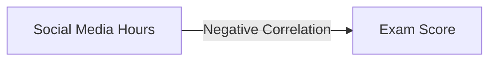

# 📚 Student Performance Analysis 
## A Deep Dive into Academic Success Factors 🎓


## 🎯 Project Overview

This Jupyter notebook analyzes various factors affecting student academic performance, providing insights into the relationships between study habits, lifestyle choices, and academic outcomes.

### 🔍 Key Areas of Analysis

- 📖 Study Hours Impact
- 💻 Social Media Usage
- 🎬 Netflix Consumption
- 😴 Sleep Patterns
- 👥 Gender Differences
- 💼 Part-time Work Effects
- 🏃 Extracurricular Activities
- 🍎 Diet Quality
- 🧠 Mental Health

## 🛠️ Technologies Used

- **Python** 3.x
- **Libraries**:
  - pandas (data manipulation)
  - numpy (numerical operations)
  - matplotlib & seaborn (static visualizations)
  - plotly (interactive visualizations)
  - scipy (statistical analysis)

## 📊 Key Findings

### Study Hours vs Performance
> **Correlation: 0.75**
- Strong positive correlation between study hours and exam scores
- Each additional hour of study associated with higher performance

### Social Media Impact


### Sleep Patterns
| Sleep Hours | Performance Impact |
|-------------|-------------------|
| < 6 hours   | ⬇️ Lower scores  |
| 7-8 hours   | ⬆️ Optimal range |
| > 9 hours   | ➡️ Diminishing returns |

## 🎨 Visualizations

The notebook includes various interactive and static visualizations:
- Box plots for categorical comparisons
- Scatter plots with regression lines
- Interactive Plotly charts
- Distribution plots

## 💡 Key Insights

1. **Study Habits** 📚
   - Direct correlation with academic performance
   - Quality matters as much as quantity

2. **Digital Distractions** 📱
   - Social media shows negative correlation
   - Netflix consumption impacts study effectiveness

3. **Lifestyle Factors** 🌟
   - Diet quality significantly affects performance
   - Extracurricular activities show positive impact
   - Mental health strongly correlates with academic success

## 🚀 Getting Started

1. Clone this repository
2. Install required packages:
```bash
pip install pandas numpy matplotlib seaborn scikit-learn plotly plotly_express scipy
```
3. Open the Jupyter notebook:
```bash
jupyter notebook performance.ipynb
```

## 📈 Results Preview


## 🤝 Contributing

Feel free to fork this project and submit improvements. Areas for potential enhancement:
- Additional visualization types
- More detailed statistical analysis
- Machine learning predictions

## 📝 License

This project is licensed under the MIT License - see the LICENSE file for details.

## ✨ Acknowledgments

Special thanks to:
- Educational institutions providing data
- Data science community
- Open source contributors

---

<p align="center">
Made with ❤️ for education analysis
</p>
