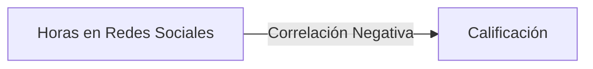

# 📚 Análisis del Rendimiento Estudiantil
## Una Mirada Profunda a los Factores del Éxito Académico 🎓


## 🎯 Descripción General del Proyecto

Este notebook Jupyter analiza varios factores que afectan el rendimiento académico de los estudiantes, proporcionando información sobre las relaciones entre los hábitos de estudio, el estilo de vida y los resultados académicos.

### 🔍 Áreas Clave de Análisis

- 📖 Impacto de las Horas de Estudio
- 💻 Uso de Redes Sociales
- 🎬 Consumo de Netflix
- 😴 Patrones de Sueño
- 👥 Diferencias de Género
- 💼 Efectos del Trabajo a Tiempo Parcial
- 🏃 Actividades Extracurriculares
- 🍎 Calidad de la Dieta
- 🧠 Salud Mental

## 🛠️ Tecnologías Utilizadas

- **Python** 3.x
- **Bibliotecas**:
   - pandas (manipulación de datos)
   - numpy (operaciones numéricas)
   - matplotlib & seaborn (visualizaciones estáticas)
   - plotly (visualizaciones interactivas)
   - scipy (análisis estadístico)

## 📊 Hallazgos Principales

### Horas de Estudio vs Rendimiento
> **Correlación: 0.75**
- Fuerte correlación positiva entre horas de estudio y calificaciones
- Cada hora adicional de estudio asociada con mayor rendimiento

### Impacto de las Redes Sociales


### Patrones de Sueño
| Horas de Sueño | Impacto en el Rendimiento |
|----------------|---------------------------|
| < 6 horas      | ⬇️ Calificaciones más bajas |
| 7-8 horas      | ⬆️ Rango óptimo |
| > 9 horas      | ➡️ Rendimientos decrecientes |

## 🎨 Visualizaciones

El notebook incluye varias visualizaciones interactivas y estáticas:
- Diagramas de caja para comparaciones categóricas
- Gráficos de dispersión con líneas de regresión
- Gráficos interactivos con Plotly
- Gráficos de distribución

## 💡 Ideas Principales

1. **Hábitos de Estudio** 📚
    - Correlación directa con el rendimiento académico
    - La calidad importa tanto como la cantidad

2. **Distracciones Digitales** 📱
    - Las redes sociales muestran correlación negativa
    - El consumo de Netflix impacta la efectividad del estudio

3. **Factores del Estilo de Vida** 🌟
    - La calidad de la dieta afecta significativamente el rendimiento
    - Las actividades extracurriculares muestran impacto positivo
    - La salud mental se correlaciona fuertemente con el éxito académico

## 🚀 Comenzando

1. Clona este repositorio
2. Instala los paquetes requeridos:
```bash
pip install pandas numpy matplotlib seaborn scikit-learn plotly plotly_express scipy
```
3. Abre el notebook Jupyter:
```bash
jupyter notebook performance.ipynb
```

## 📈 Vista Previa de Resultados


## 🤝 Contribuciones

Siéntete libre de hacer fork de este proyecto y enviar mejoras. Áreas de posible mejora:
- Tipos adicionales de visualización
- Análisis estadístico más detallado
- Predicciones con machine learning

## 📝 Licencia

Este proyecto está licenciado bajo la Licencia MIT - ver el archivo LICENSE para más detalles.

## ✨ Agradecimientos

Agradecimientos especiales a:
- Instituciones educativas que proporcionaron datos
- Comunidad de ciencia de datos
- Contribuyentes de código abierto

---

<p align="center">
Hecho con ❤️ para el análisis educativo
</p>

